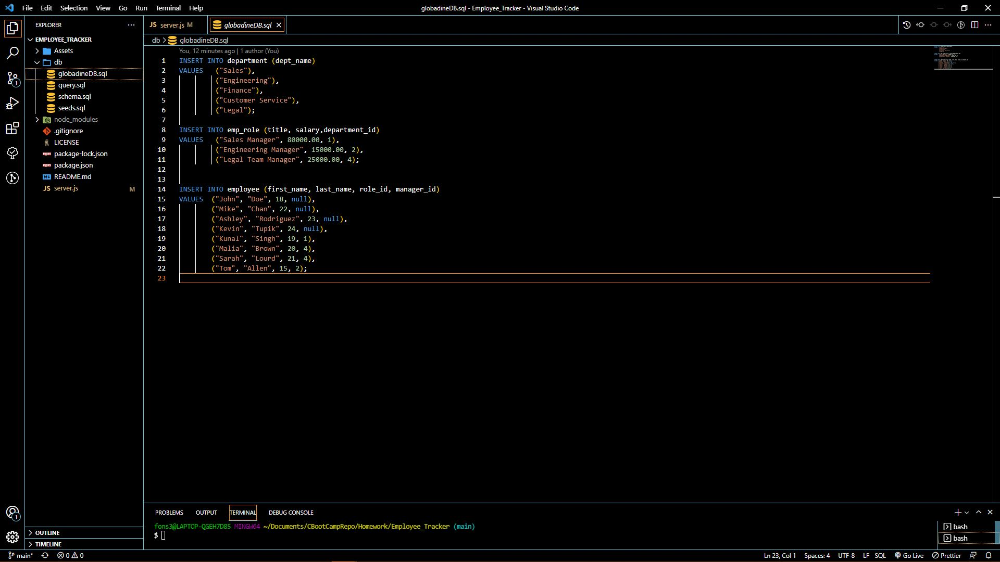

# Project Title:
Employee_Tracker

## Description:
Employee_Tracker is a node.js application with npm inquirer, npm mysql2, and npm console.table being utilized to create databases and tables inside. The application allows its users to create, read, update and delete information based on the user's queries.

### Table of Contents:
* [Description](#description)
* [Contributors](#contributors)
* [Installation](#installation)
* [Developer_Profile](#developer_profile)
* [Screeshots/Links](#screenshots/links)

### Screenshots/Links
[Screencastify_video](https://watch.screencastify.com/v/yR9qhbuRV2OancAdOHB8)

### Contributors:
Alfonso Robles

#### Installation:
npm i, npm mysql2, npm console.table

##### Developer_Profile:
[Github Profile](https://github.com/fons3517)
