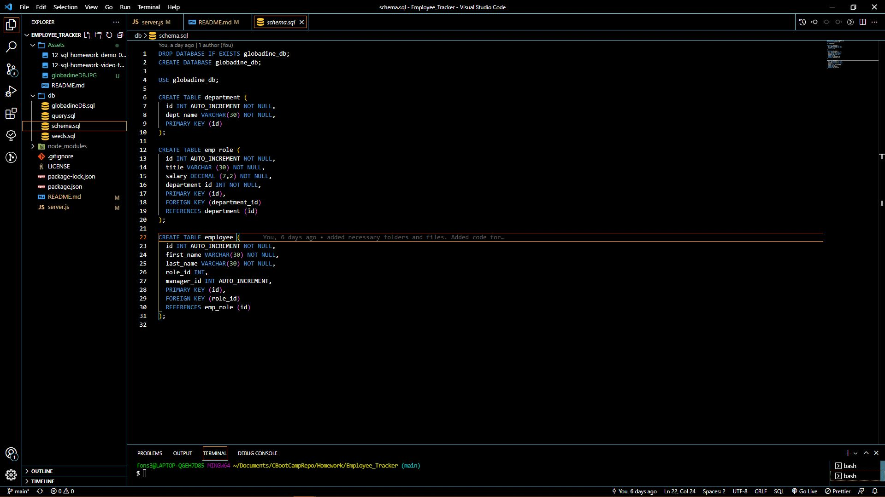

# Project Title:
Employee_Tracker

## Description:
This application is a node.js file with npm inquirer, npm mysql2, and npm console.table being utilized to create databases and tables inside.

### Screenshots/Links
[Screencastify_video](https://watch.screencastify.com/v/yR9qhbuRV2OancAdOHB8)

### Contributors:
Alfonso Robles
### Table of Contents:
* [Description](#description)
* [Contributors](#contributors)
* [Installation](#installation)
* [Developer_Profile](#developer_profile)
* [Screeshots/Links](#screenshots/links)

#### Installation:
npm i, npm mysql2, npm console.table

##### Developer_Profile:
[Github Profile](https://github.com/fons3517)
